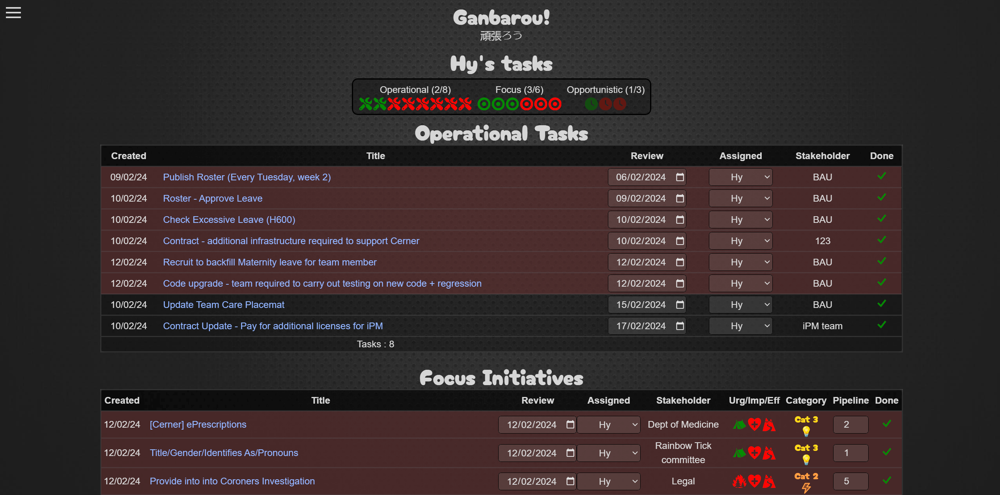
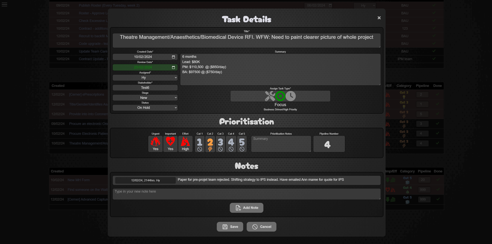

<a ID="readme-top"></a>

<div align="center">

# Ganabrou! 
## Let's do our best!

[](https://opensource.org/licenses/MIT)
[](https://nodejs.org/en)


Project 3 - MERN Stack

</div>

## Description

Ganbarou is a task management and prioritisation solution designed for a team of users with needing to balance demands from operational and business demands. 

Ganbarou sets itself apart from other task management solutions by making use of a "review date" for each task and in the way tasks are classified and prioritised.

High level features of the application are:
* Task tracking across team members (add, complete, update tasks)
* Assisting the user with focusing on tasks that require attention
* Grouping tasks into task types (Operational and Business Driven) to organise and prioritise work
* Processes to prioritise business driven initiatives into a pipeline of works.
* Transparency of task status across the team for more efficient and effective management.
* Responsive design that is mobile-friendly
* Stripe integration enabling "buy me a coffee" donations

Ganbarou is built on the MERN technology stack (Utilising React Context API) and is deployed on Heroku.

## Table of contents


- [User Story](#user-story)
- [User Acceptance Critieria](#user-acceptance-criteria)
- [Installation](#installation)
- [Usage](#usage)
- [Screenshots](#screenshots)
- [License](#license)
- [Contributing](#contributing)
- [Testing](#testing)
- [Questions](#questions)

## User Story <a ID="user-story"></a>

```md
AS a member of a team in high demand

I WANT to be able to manage by tasks effectively and be clear on what my priorities are 
SO THAT I can remain effective and efficient


As manager of a team in high demand

I WANT to have transparency of all team tasks 
SO THAT I can effectively manage the team AND collaborate with the business stakeholders to organsie pipelines of work
```

<p align="right">(<a href="#readme-top">back to top</a>)</p>

## User Acceptance Criteria

### This application was developed with the below User acceptance criteria:

```
GIVEN a task management solution

WHEN I load task management solution
THEN I am presented with a welcome screen with options to Login or Sign up to the application

WHEN I log in or sign up
THEN I am presented with my list of tasks assigned to me. Tasks are grouped into 3 categories - Operational, Focus, and Opportunistic. At the top of the screen is a summary of tasks and their status, followed by detailed lists of tasks for each type (Namely, operational, focus, opportunistic)

WHEN reviewing operational tasks on my tasklist
THEN I am presented with columns relevant to Operational tasks (Prioritisation columns are hidden)

WHEN reviewing business driven tasks on my tasklist (Focus and Oppostunistic)
THEN I am presented with columns relevant to Business Driven request which includes prioritisation columns (Urgent/Important/Effort, Category and Pipieline)

WHEN review the my tasklist
THEN tasks with an elapsed review date are shaded red to highlight their need for attention, tasklists are generally sorted by review date to keep the most pressing tasks on top of the list (The business driven task list is sorted by Pipeline number)

WHEN changing the review date
THEN tasks on the tasklist will sort itself by review date, the application will determine if a red shaded background is required and the task summary icon at the top of the page will also update to reflect status

WHEN interacting with tasklists
THEN I am able to change review date, assigned team member and pipeline number directly on the table. Clicking on the Title will open to the detail screen of the task. 

WHEN I hover my mouse over the title (or long-tap on a phone/tablet)
THEN Hovering my mouse over the title will show a tooltip of the task summary and stakeholder.


```

<p align="right">(<a href="#readme-top">back to top</a>)</p>

## Screenshots


Screeshot of search results for Javascript
<div align="center">


</div>

Screenshot of books saved by a User
<div align="center">


</div>

<p align="right">(<a href="#readme-top">back to top</a>)</p>

## Installation

My portfolio is a deployed application available via this link: [Hybee's Google Book Search Engine (MERN)](https://hybee-book-search-engine-e306e54d030c.herokuapp.com/)

The below installations steps are only required if you want to run a local copy or contribute to its design (Skip to usage if you just want to make use of the application)

1. Clone or fork the repository
2. Run the below in console install necessary packages    
    
```
npm i
```
3. Once installed you can start the client server services with the below command in the CLI:
```
npm run dev
```

<p align="right">(<a href="#readme-top">back to top</a>)</p>

## Usage

My portfolio is a deployed application available via this link: [Hybee's Google Book Search Engine (MERN)](https://hybee-book-search-engine-e306e54d030c.herokuapp.com/)

When launched, this application will present with a search field. You can search for books (utilising Google) without logging in, however it is recommended to sign up so that you can save books of interest against your accoun. You can view and delete saved books in the "See Your Books" screen.

<p align="right">(<a href="#readme-top">back to top</a>)</p>
    
## License

[](https://opensource.org/licenses/MIT)

This application can be used in conjunction with licensing covered in  <b>MIT Lcensee</b>

(Click on the badge for details of the license)

<p align="right">(<a href="#readme-top">back to top</a>)</p>

## Contributing

To contribute to this application, please reach out to me via my contact details below

<p align="right">(<a href="#readme-top">back to top</a>)</p>

## Testing

Automated Test scripts have not been developed for this application

<p align="right">(<a href="#readme-top">back to top</a>)</p>

## Questions

- Visit my GitHub page: <a href="https://github.com/hybee234"> hybee234 </a>
  
<p align="right">(<a href="#readme-top">back to top</a>)</p>

